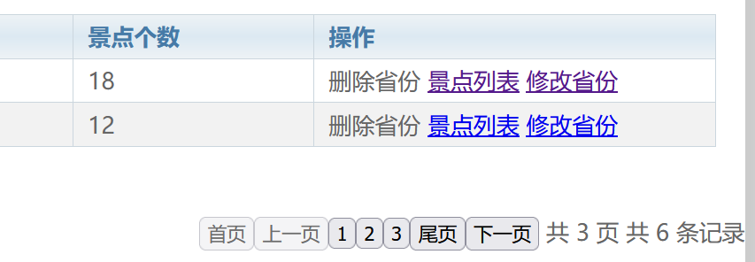
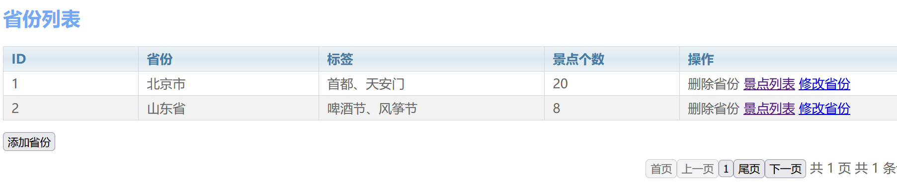
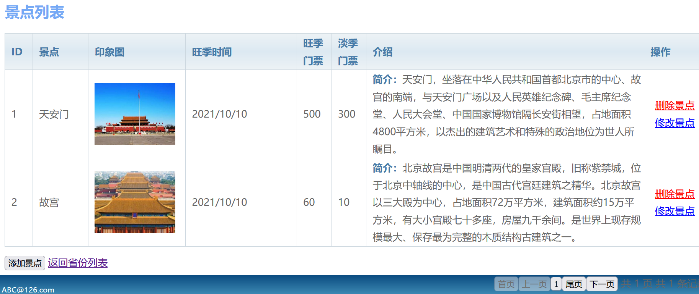

# 工程简介
    本项目使用了springboot+mybatis-plus+vue+jquery(利用了jquery插件做了分页条)
使用了三张表，分别为用户表user,省份表province,景点表attractions
用户可以对省份及其省份内的景点实现增删改查功能，加入了事物管理,回滚采用了运行时异常

此项目只适用于学习技术
# 延伸阅读

1.该项目用户少，没有加入springsecurity,shiro等安全框架
2.没有使用element-ui,尝试引入了jQuery插件做分页条，发现 
jquery交互性不行，和vue之间的配合不那么友好(比如：分页条一定要点击之后才有反应，而不是vue渲染之后)

